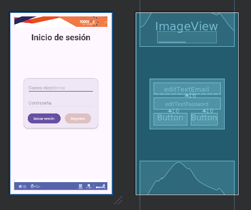
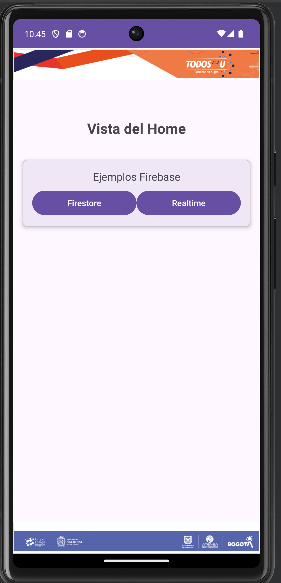
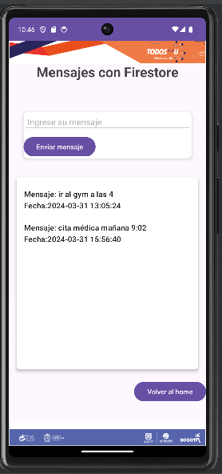
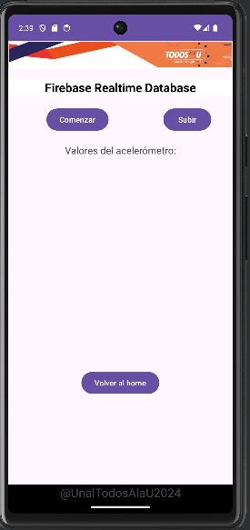

# Ejemplo de uso e implementación de Firebase con Android

| Imagenes                                     | Imagenes                                     |
|----------------------------------------------|----------------------------------------------|
|  |  |
|  |  |
|  |                                              |