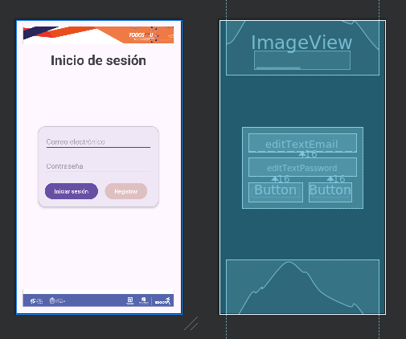
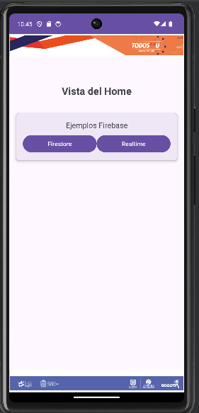
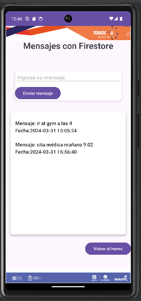
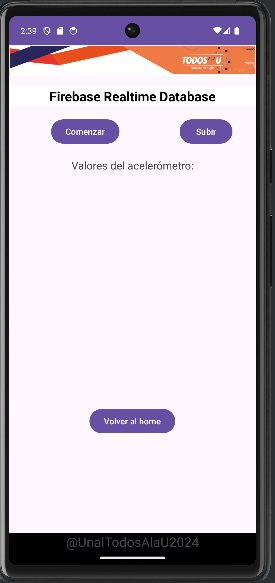

# Ejemplo de uso e implementación de Firebase con Android

| Imagenes                                      | Imagenes                                      |
|-----------------------------------------------|-----------------------------------------------|
|  |  |
|  |  |
                                          |